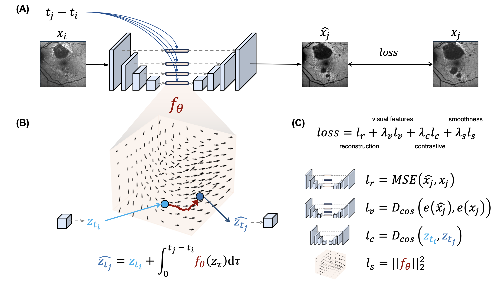

# ImageFlowNet
### Krishnaswamy Lab, Yale University
[](https://twitter.com/KrishnaswamyLab)
[](https://github.com/ChenLiu-1996/MedicalImageProgression/)

This is the authors' implementation of [**ImageFlowNet**](https://arxiv.org/pdf/2406.14794). The official codebase is maintained in the [Lab GitHub repo](https://github.com/KrishnaswamyLab/ImageFlowNet).


## A Glimpse into the Methods


## Citation

```
@article{liu2024imageflownet,
  title={ImageFlowNet: Forecasting Multiscale Trajectories of Disease Progression with Irregularly-Sampled Longitudinal Medical Images},
  author={Liu, Chen and Xu, Ke and Shen, Liangbo L and Huguet, Guillaume and Wang, Zilong and Tong, Alexander and Bzdok, Danilo and Stewart, Jay and Wang, Jay C and Del Priore, Lucian V and Krishnaswamy, Smita}
  journal={arXiv preprint arXiv:2406.14794},
  year={2024}
}
```

## Abstract
The forecasting of disease progression from images is a holy grail for clinical decision making. However, this task is complicated by the inherent high dimensionality, temporal sparsity and sampling irregularity in longitudinal image acquisitions. Existing methods often rely on extracting hand-crafted features and performing time-series analysis in this vector space, leading to a loss of rich spatial information within the images. To overcome these challenges, we introduce ImageFlowNet, a novel framework that learns latent-space flow fields that evolve multiscale representations in joint embedding spaces using neural ODEs and SDEs to model disease progression in the image domain. Notably, ImageFlowNet learns multiscale joint representation spaces by combining cohorts of patients together so that information can be transferred between the patient samples. The dynamics then provide plausible trajectories of progress, with the SDE providing alternative trajectories from the same starting point. We provide theoretical insights that support our formulation of ODEs, and motivate our regularizations involving high-level visual features, latent space organization, and trajectory smoothness. We then demonstrate ImageFlowNet's effectiveness through empirical evaluations on three longitudinal medical image datasets depicting progression in retinal geographic atrophy, multiple sclerosis, and glioblastoma.


## Repository Hierarchy
```
ImageFlowNet
    ├── comparison: some comparisons are in the `src` folder instead.
    |   └── interpolation
    |
    ├── checkpoints: only for segmentor model weights. Other model weights in `results`.
    |
    ├── data: folders containing data files.
    |   ├── brain_LUMIERE: Brain Glioblastoma
    |   ├── brain_MS: Brain Multiple Sclerosis
    |   └── retina_ucsf: Retinal Geographic Atrophy
    |
    ├── external_src: other repositories or code.
    |
    ├── results: generated results, including training log, model weights, and evaluation results.
    |
    └── src
        ├── data_utils
        ├── datasets
        ├── nn
        ├── preprocessing
        ├── utils
        └── *.py: some main scripts
```

## Pre-trained weights
We have uploaded the weights for the retinal images.
1. The weights for the segmentor can be found in `checkpoints/segment_retinaUCSF_seed1.pty`
2. The weights for the ImageFlowNetODE models can be found in [Google Drive](https://drive.google.com/drive/folders/1fXgSU8GUUBQ2DTgglsu4rRDoV9gQVyU_). You can put them under `results/retina_ucsf_ImageFlowNetODE_smoothness-0.100_latent-0.001_contrastive-0.010_invariance-0.000_seed_1/run_1/retina_ucsf_ImageFlowNetODE_smoothness-0.100_latent-0.001_contrastive-0.010_invariance-0.000_seed_1_best_pred_psnr.pty` and `results/retina_ucsf_ImageFlowNetODE_smoothness-0.100_latent-0.001_contrastive-0.010_invariance-0.000_seed_1/run_1/retina_ucsf_ImageFlowNetODE_smoothness-0.100_latent-0.001_contrastive-0.010_invariance-0.000_seed_1_best_seg_dice.pty`.

## Reproduce the results

### Image registration
```
cd src/preprocessing
python test_registration.py
```

### Training a segmentation network (only for quantitative evaluation purposes)
```
cd src/
python train_segmentor.py
```

### Training the main network.
```
cd src/
# ImageFlowNet_{ODE}
python train_2pt_all.py --model ImageFlowNetODE --random-seed 1
python train_2pt_all.py --model ImageFlowNetODE --random-seed 1 --mode test --run-count 1

# ImageFlowNet_{SDE}
python train_2pt_all.py --model ImageFlowNetSDE --random-seed 1
python train_2pt_all.py --model ImageFlowNetSDE --random-seed 1 --mode test --run-count 1
```

### Some common arguments.
```
--dataset-name: name of the dataset (`retina_ucsf`, `brain_ms`, `brain_gbm`)
--segmentor-ckpt: the location of the segmentor model. Both for training and using the segmentor.
```

### Ablations.
1. Flow field formulation.
```
python train_2pt_all.py --model ODEUNet
python train_2pt_all.py --model ImageFlowNetODE
```

2. Single-scale vs multiscale ODEs.
```
python train_2pt_all.py --model ImageFlowNetODE --ode-location 'bottleneck'
python train_2pt_all.py --model ImageFlowNetODE --ode-location 'all_resolutions'
python train_2pt_all.py --model ImageFlowNetODE --ode-location 'all_connections' # default
```

3. Visual feature regularization.
```
python train_2pt_all.py --model ImageFlowNetODE --coeff-latent 0.1
```

4. Contrastive learning regularization.
```
python train_2pt_all.py --model ImageFlowNetODE --coeff-contrastive 0.1
```

5. Trajectory smoothness regularization.
```
python train_2pt_all.py --model ImageFlowNetODE --coeff-smoothness 0.1
```

### Comparisons
Image interpolation/extrapolation methods.
```
cd comparison/interpolation
python run_baseline_interp.py --method linear
python run_baseline_interp.py --method cubic_spline
```

Time-conditional UNet.
```
cd src
python train_2pt_all.py --model T_UNet --random-seed 1 --mode train
python train_2pt_all.py --model T_UNet --random-seed 1 --mode test --run-count 1
```

Time-aware diffusion model (Image-to-Image Schrodinger Bridge)
```
cd src
python train_2pt_all.py --model I2SBUNet --random-seed 1
python train_2pt_all.py --model I2SBUNet --random-seed 1 --mode test --run-count 1
```

Style-based Manifold Extrapolation (Nat. Mach. Int. 2022).
```
conda deactivate
conda activate stylegan

cd src/preprocessing
python 04_unpack_retina_UCSF.py

cd ../../comparison/style_manifold_extrapolation/stylegan2-ada-pytorch
python train.py --outdir=../training-runs --data='../../../data/retina_ucsf/UCSF_images_final_unpacked_256x256/' --gpus=1

```

## Datasets
1. Retinal Geographic Atrophy dataset from METforMIN study (UCSF).
    - Paper: https://www.sciencedirect.com/science/article/pii/S2666914523001720.
    - You may contact the authors. Data may or may not be available.
2. Brain Multiple Sclerosis dataset.
    - Paper: https://www.sciencedirect.com/science/article/pii/S1053811916307819?via%3Dihub
    - Data can be requested here: https://iacl.ece.jhu.edu/index.php?title=MSChallenge/data
    - Or more specifically, here: https://smart-stats-tools.org/lesion-challenge
3. Brain Glioblastoma dataset.
    - Paper: https://www.nature.com/articles/s41597-022-01881-7
    - Data can be downloaded here: https://springernature.figshare.com/collections/The_LUMIERE_Dataset_Longitudinal_Glioblastoma_MRI_with_Expert_RANO_Evaluation/5904905/1

## Data preparation and preprocessing
1. Retinal Geographic Atrophy dataset.
- Put data under: `data/retina_ucsf/Images/`
```
cd src/preprocessing
python 01_preprocess_retina_UCSF.py
python 02_register_retina_UCSF.py
python 03_crop_retina_UCSF.py
```

2. Brain Multiple Sclerosis dataset.
- Put data under: `data/brain_MS/brain_MS_images/trainX/` after unzipping.
```
cd src/preprocessing
python 01_preprocess_brain_MS.py
```

3. Brain Glioblastoma dataset.
- Put data under: `data/brain_LUMIERE/` after unzipping.
```
cd src/preprocessing
python 01_preprocess_brain_GBM.py
```

## Segment Anything Model (SAM)
This is only used for `test_registration.py` to facilitate visualization. Not used anywhere else.
```
cd `external_src/`
mkdir SAM && cd SAM
wget https://dl.fbaipublicfiles.com/segment_anything/sam_vit_h_4b8939.pth
```

## Dependencies
We developed the codebase in a miniconda environment.
How we created the conda environment:
```
# Optional: Update to libmamba solver.
conda update -n base conda
conda install -n base conda-libmamba-solver
conda config --set solver libmamba

conda create --name imageflownet pytorch==1.12.1 torchvision==0.13.1 torchaudio==0.12.1 cudatoolkit=11.3 -c pytorch -c nvidia -c anaconda -c conda-forge
conda activate imageflownet
conda install scikit-learn scikit-image pillow matplotlib seaborn tqdm -c pytorch -c anaconda -c conda-forge
conda install read-roi -c conda-forge
python -m pip install -U albumentations
python -m pip install timm
python -m pip install opencv-python
python -m pip install git+https://github.com/facebookresearch/segment-anything.git
python -m pip install monai
python -m pip install torchdiffeq
python -m pip install torch-ema
python -m pip install torchcde
python -m pip install torchsde
python -m pip install phate
python -m pip install psutil
python -m pip install ninja

# For 3D registration
python -m pip install antspyx
```

<!--
# Environment for stylegan2-ada
```
conda create --name stylegan python=3.8 -c anaconda
conda activate stylegan
conda install scikit-learn scikit-image pillow matplotlib seaborn tqdm -c pytorch -c anaconda -c conda-forge
python -m pip install torch==1.8.1+cu111 torchvision==0.9.1+cu111 torchaudio==0.8.1 -f https://download.pytorch.org/whl/torch_stable.html
python -m pip install opencv-python
python -m pip install psutil
python -m pip install ninja
python -m pip install requests
conda install -c conda-forge gcc=12.1.0
```
-->


## Acknowledgements
We adapted some of the code from
1. [I^2SB: Image-to-Image Schrodinger Bridge](https://github.com/NVlabs/I2SB)
